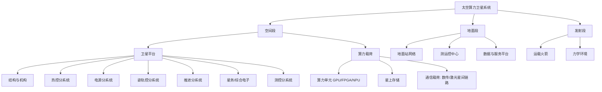

# 太空算力卫星知识库（Space Compute Satellite KB）

> 读者定位：AI 芯片算子工程师，创业方向为太空算力卫星（在轨计算 / 天基算力服务 / 太空数据中心）。
> 本知识库假设你已精通算力本身（TOPS、算子、推理/训练、量化、芯片架构），**不再重复讲解**，只聚焦"地面算力 → 太空算力"的差异映射与航天全系统补课。

## 一、为什么算力上天要重学一整套知识

地面数据中心的默认前提，在太空全部被推翻：

| 维度  | 地面数据中心         | 太空算力卫星                                      | 对应模块                           |
| --- | -------------- | ------------------------------------------- | ------------------------------ |
| 散热  | 风冷/液冷，空气与水近乎免费 | 只有热辐射一条路，散热面即整星"尺寸驱动者"                      | [05 热控](05-热控与散热.md)           |
| 供电  | 市电+UPS，兆瓦级随便用  | 太阳阵+蓄电池，整星按瓦级精打细算（StarCloud-2 整星仅 8 kW）     | [03 平台-电源](03-卫星平台分系统.md)      |
| 可靠性 | 坏一台换一台，冗余服务器   | 不可维修，靠抗辐射设计（TMR/ECC/系统级容错）                  | [06 辐射与可靠性](06-辐射环境与抗辐射可靠性.md) |
| 网络  | 光纤/以太网，带宽近乎无限  | 激光星间链路（100 Gbps 级）+ 星地数传，过境窗口有限             | [07 通信](07-通信与星间组网.md)         |
| 运维  | 驻场 7x24        | 全自主 + 地面遥测遥控 + OTA（三体星座 2 天完成 80 亿参数模型在轨更新） | [09 运营](09-地面系统与星座运营.md)       |
| 部署  | 卡车运机柜          | 火箭发射：振动/冲击/噪声，每公斤数万元                        | [08 结构与发射](08-结构机构与发射环境.md)    |
| 环境  | 恒温恒湿机房         | 真空、±100°C 热循环、辐射、原子氧                        | [01 空间环境](01-航天总体与空间环境.md)     |

## 二、卫星系统分解（知识地图）

一颗算力卫星 = 平台（通用能力）+ 载荷（算力与通信，你的核心价值）+ 地面段。

## 三、模块清单与优先级

| #   | 模块                               | 优先级    | 建议用时   | 一句话定位                  |
| --- | -------------------------------- | ------ | ------ | ---------------------- |
| 01  | [航天总体与空间环境](01-航天总体与空间环境.md)     | 高      | 3-4 天  | 建立"太空是什么环境"的物理直觉       |
| 02  | [轨道力学与星座设计](02-轨道力学与星座设计.md)     | 高      | 5-7 天  | 算力卫星选什么轨道、怎么组网         |
| 03  | [卫星平台分系统](03-卫星平台分系统.md)         | 高      | 7-10 天 | 星务/姿控/电源/推进/测控全览       |
| 04  | [算力载荷与太空服务器](04-算力载荷与太空服务器.md)   | **极高** | 2-3 周  | 你的主业：器件、容错、存算传一体、星上软件栈 |
| 05  | [热控与散热](05-热控与散热.md)             | **极高** | 1-2 周  | 算力卫星第一物理瓶颈             |
| 06  | [辐射环境与抗辐射可靠性](06-辐射环境与抗辐射可靠性.md) | **极高** | 1-2 周  | 第二物理瓶颈，决定芯片选型与架构       |
| 07  | [通信与星间组网](07-通信与星间组网.md)         | 高      | 1 周    | 数据进出通道，决定商业模式上限        |
| 08  | [结构机构与发射环境](08-结构机构与发射环境.md)     | 中      | 3-4 天  | 活下来上天，可展开辐射器属于这里       |
| 09  | [地面系统与星座运营](09-地面系统与星座运营.md)     | 中高     | 3-4 天  | 运营期每天打交道的东西            |
| 10  | [工程流程标准与法规](10-工程流程标准与法规.md)     | 高      | 4-5 天  | 合规是创业前置条件（频率/许可/碎片）    |
| 11  | [产业格局与商业模式](11-产业格局与商业模式.md)     | **极高** | 持续跟踪   | 竞争对手、技术路线、经济账、切入点      |

## 四、四阶段学习路线图

### 阶段一：全景认知（第 1-2 周）

目标：能用行话和卫星总体设计师对话。

- 通读 01 → 02 → 03，不求深，建立完整框架
- 精读 11，搞清楚自己在这条赛道的哪个位置
- 自测：能画出上面那张系统分解图并讲清每个分系统的职责

### 阶段二：核心分系统攻坚（第 3-8 周）

目标：能主导算力载荷方案论证。

- 精读 04（算力载荷）→ 05（热控）→ 06（辐射），这三者互为约束，建议交叉着学
- 关键产出：动手算一遍——给定 5 kW 算力载荷，估算辐射器面积、铝屏蔽质量、单粒子翻转率
- 自测：能向投资人解释清楚"为什么算力上天难，以及你的解法"

### 阶段三：工程化与运营（第 9-13 周）

目标：知道一颗星从图纸到在轨运营的全流程。

- 通读 07 → 08 → 09 → 10
- 重点：环境试验体系（热真空/振动）、ITU 频轨申报流程、发射许可时间线（提前 9 个月）
- 自测：能列出首颗星从立项到发射的完整里程碑清单与合规动作

### 阶段四：产业跟踪（持续）

- 每月更新 11：三体计算星座组网进度、StarCloud-2（2026 年 10 月发射）、Google Suncatcher 双星原型（2027 年初）、NVIDIA Space-1 Vera Rubin 模组
- 跟踪标准更新：GB/T 29072/29073-2026（2026 年 9 月实施）、GB/T 34513-2026 空间碎片减缓（2026 年 11 月强制实施）

## 五、每个模块的统一结构

1. **学习目标** — 学完能干什么
2. **核心知识点** — 分层展开，关键参数给真实量级
3. **对算力卫星意味着什么** — 专项视角，直接关联你的创业决策
4. **推荐资源** — 书/标准/论文/课程，中英文兼顾
5. **自测清单** — 检验是否真正掌握

## 六、通用参考书（贯穿所有模块）

- 《Space Mission Analysis and Design》(SMAD, Wertz & Larson) — 航天界的"圣经"，所有分系统一章通吃
- 《Space Vehicle Design》(Griffin & French) — 系统设计方法
- 《卫星总体设计》（国防工业出版社）— 中文体系教材
- ECSS 标准体系（欧洲空间标准化合作组织）— 免费公开，工程实践参照
- NASA Systems Engineering Handbook（NASA/SP-2016-6105 Rev2）— 免费 PDF

