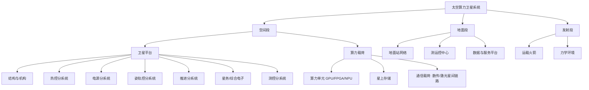

# 太空算力卫星知识库（Space Compute Satellite KB）

> 面向 AI 芯片/算子工程师转型太空算力创业的系统化知识库。**详解版**：每个模块已从大纲扩写至书章节级——含原理拆解、公式推导、数值算例、案例分析与执行清单。

## 核心认知：太空算力与地面算力的本质差异

| 维度 | 地面数据中心 | 太空算力卫星 |
|---|---|---|
| 散热 | 空气/水冷，近乎无限 | 纯辐射，受 Stefan-Boltzmann T⁴ 定律约束 |
| 供电 | 电网 | 太阳能 + 电池，kW 级起步 |
| 可靠性 | 可维修、可替换 | 不可维修，容错设计 + 任务级冗余 |
| 环境 | 恒温恒湿无尘 | 真空、±100°C 热循环、辐射、原子氧 |
| 带宽 | 光纤，近乎无限 | 无线/激光，窗口化、昂贵 |
| 器件 | 最新商用 | 抗辐射（落后 3-5 代）或加固 COTS |
| 失效成本 | 换机器 | 任务失败，数千万-数亿损失 |

## 卫星系统分解

## 模块清单（详解版）

| 模块 | 文件 | 核心内容 | 优先级 |
|---|---|---|---|
| 01 | [航天总体与空间环境](01-航天总体与空间环境.md) | 四段组成、预算表体系、真空/热/辐射/AO/碎片/微重力/充放电的机理+公式+算例 | ★★★★★ |
| 02 | [轨道力学与星座设计](02-轨道力学与星座设计.md) | 活力公式/霍曼转移/J2-SSO 推导、大气阻力寿命、Walker 星座、ISL 几何、离轨 | ★★★★☆ |
| 03 | [卫星平台分系统](03-卫星平台分系统.md) | OBDH/FDIR、姿态动力学、太阳翼/电池 sizing、母线电压、推进选型 | ★★★★☆ |
| 04 | [算力载荷与太空服务器](04-算力载荷与太空服务器.md) | 三条器件路线、四层容错栈（TMR/ECC/ABFT/Checkpoint）、存算传一体、软件栈 | ★★★★★ |
| 05 | [热控与散热](05-热控与散热.md) | 辐射排散、热阻网络、热管/LHP/两相回路、PCM、1kW 算力舱完整热设计实例 | ★★★★★ |
| 06 | [辐射环境与抗辐射可靠性](06-辐射环境与抗辐射可靠性.md) | TID/SEE/DDD 机理、Weibull-LET 错误率链条、辐照试验、FMEA/降额 | ★★★★★ |
| 07 | [通信与星间组网](07-通信与星间组网.md) | 链路预算推导、激光 APT 与提前瞄准、站址分集、DTN/CGR、带宽反推 | ★★★★☆ |
| 08 | [结构机构与发射环境](08-结构机构与发射环境.md) | 四类力学载荷、一阶频率约束、GPU 模组加固、展开机构、试验矩阵 | ★★★☆☆ |
| 09 | [地面系统与星座运营](09-地面系统与星座运营.md) | 站网方案、自动化运营分级、四维联合调度、PHM、网络安全 | ★★★★☆ |
| 10 | [工程流程标准与法规](10-工程流程标准与法规.md) | 研制阶段裁剪、AIT、ITU 频率、碎片合规、数据法规、首星合规时间线 | ★★★★☆ |
| 11 | [产业格局与商业模式](11-产业格局与商业模式.md) | 玩家详卡、三种模式经济账、太空 vs 地面 TCO、C→A→B 路径、里程碑 | ★★★★★ |

## 贯穿案例

全书使用一个统一的虚拟案例星——**算星一号**（150 kg、550 km 晨昏 SSO、1 kW 算力载荷、3 年寿命）——在各模块中反复出现：模块 01 做预算表、02 做轨道设计、03 提平台需求、04 选器件与容错、05 做热设计、06 做可靠性、07 配链路、08 做力学加固、09 配地面段、10 排合规时间线、11 算经济账。

## 学习路径建议

### 第一阶段：建立直觉（1-2 周）
模块 01 → 02 → 05。目标：能说出"为什么算力卫星选晨昏 SSO"、"为什么散热是第一瓶颈"。

### 第二阶段：深入核心（3-4 周）
模块 04 → 06 → 03。目标：能为一颗算力试验星做出载荷方案与平台需求清单。

### 第三阶段：系统闭环（2-3 周）
模块 07 → 08 → 09 → 10。目标：能画出整星+地面+合规的完整方案图。

### 第四阶段：商业落地（持续）
模块 11 + 跟踪行业动态（StarCloud、三体星座、Suncatcher 进展）。

## 每个模块的统一结构

1. **学习目标**：可自检的能力清单
2. **原理拆解**：物理/数学机理，含完整公式推导
3. **数值算例**：用真实参数做定量计算
4. **案例拆解**：真实任务/公司的工程决策分析
5. **执行清单**：可直接用于工作的检查表
6. **附录**：公式/数据速查
7. **推荐资源**：深化的书、标准、工具
8. **自测清单**：能默写才算掌握

## 通用参考书

- 《Space Mission Analysis and Design》(SMAD) —— 总体设计圣经
- 《Spacecraft Systems Engineering》(Fortescue) —— 分系统权威
- 《Spacecraft Thermal Control Handbook》(Gilmore) —— 热控圣经
- 《Fundamentals of Astrodynamics》(Bate) —— 轨道力学入门
- ECSS 标准族（免费公开）—— 欧洲航天工程标准体系
- GJB/GB 航天标准 —— 国内合规依据
