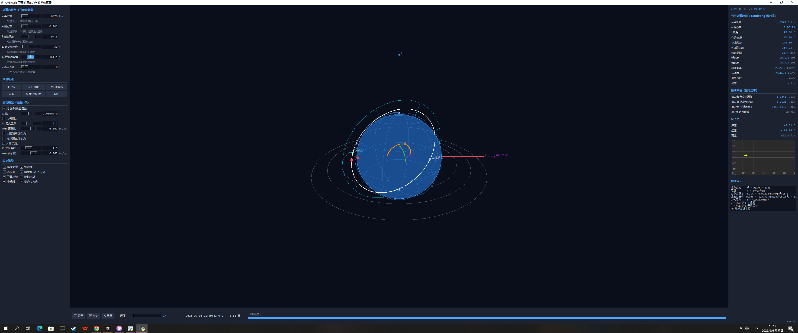

# OrbitLab（p8_orbitlab）—— 卫星轨道动力学教学仿真器

> 工业级物理内核 + 教学级可视化：六根数全程可调，五大摄动真实建模，
> 拖动滑块即时看到轨道/轨道面/角度弧的几何变化，时间轴驱动卫星真实运动。
> 物理常量与公式迁移自 NASA GMAT 源码（见 `../transfer-sim` 与
> `../../gmat-architecture-docs/math-deep-dive`），全部代码中文注释、公式就地标注。
> 零依赖：纯 Python 标准库（tkinter + math）。



## 快速开始

```powershell
cd projects\p8_orbitlab
py main.py          # 启动图形界面（历元自动对齐系统 UTC 时钟）
py test_orbitlab.py # 跑 17 个物理单元测试
```

**免 Python 环境**：双击 `dist\OrbitLab.exe`（PyInstaller 单文件打包，8.1 MB，无任何依赖）。
重新打包：`py -m PyInstaller --onefile --windowed --clean --name OrbitLab main.py`

鼠标：左键拖拽旋转视角 / 右键拖拽平移 / 滚轮缩放。
演示模式：`$env:ORBITLAB_AUTOPLAY='1'; py main.py`（自动 3600× 播放）。

## 功能对照（教学需求 → 实现）

| 需求 | 实现 |
|---|---|
| 六根数全部可调 | 左栏 a/e/i/Ω/ω/ν 滑块+数值框双向同步，带几何释义 |
| 拖拽即时联动 | 滑块变化 → 参考椭圆/轨道面/角度弧立即重绘，卫星重置到新轨道 |
| 颜色区分 | 轨道面青、赤道面灰、i 绿、Ω 紫、ω 橙、ν 红、卫星红、轨迹黄 |
| 时间轴 | 底栏 ▶/⏸/单步/重置 + 对数速度滑块 1×~100000× + UTC 仿真时钟 + 周期进度条 |
| 真实运动轨迹 | Cowell 数值积分（RK4，≤10s 子步），黄色轨迹线 + 星下点轨迹图 |
| 工业级物理 | GMAT 同款常量与公式：J2（EGM96）、指数大气+共转阻力、日/月第三体、光压+圆柱阴影 |
| 教学对照 | 右栏 osculating 瞬时值 vs J2 长期摄动率解析值，数值/理论互验 |

## 物理模型（公式来源见各文件注释）

- 中心引力 a = −μr/r³（PointMassForce.cpp）
- J2 带谐：Vallado §10 惯性系形式（Harmonic.cpp n=2 退化），J2 = −√5·C̄₂₀ = 1.0826269269e-3
- 大气阻力 a = −½ρ(h)Cd(A/m)v_rel²·v̂_rel，v_rel = v − ω⊕×r（DragForce.cpp + 分段指数大气）
- 第三体 a = −μ₃(d/d³ + r₃/r₃³)（PointMassForce.cpp 间接项；日/月解析星历）
- 太阳光压 a = ν·P☉(AU/r)²Cr(A/m)r̂☉，P☉ = 4.56e-6 N/m²，圆柱阴影 ν∈{0,1}
- J2 长期摄动率（右栏理论值）：dΩ/dt = −(3/2)J2·n(Re/p)²cos i 等三式

## 模块结构

| 文件 | 职责 |
|---|---|
| `constants.py` | GMAT 物理常量、分段指数大气表、JD/GMST 时间系统 |
| `elements.py` | 六根数↔状态矢量（PQW→IJK）、轨道采样、开普勒方程求解 |
| `perturbations.py` | 五大摄动加速度 + J2 长期摄动率解析式 + PerturbConfig |
| `propagator.py` | Cowell 传播器（RK4 定步，≤10s 子步自适应） |
| `geometry3d.py` | 轨道面/赤道面网格、i/Ω/ω/ν 角度弧采样（slerp 球面插值） |
| `render3d.py` | 球坐标相机+透视投影、地球绘制（经纬网随 GMST 自转） |
| `groundtrack.py` | 星下点轨迹（惯性系→地固系 GMST 旋转，等距圆柱投影） |
| `panels.py` | 左栏参数/右栏数据/底栏时间轴三面板 |
| `main.py` | 应用主类：双轨显示状态机 + 30FPS 动画循环 |
| `docs/ARCHITECTURE.md` | 完整开发架构图（mermaid）+ 模块 API 契约 |

## 测试（17 个，全部锁定物理数值）

- 六根数↔状态往返 < 1e-8；开普勒传播 10 圈能量守恒 < 1e-6
- **J2 数值传播 1 天 vs 解析长期摄动率，偏差 < 5%**（内核与理论互验）
- 阻力单调衰减、共转大气阻力方向、光压阴影内为零、GMST(J2000)=280.46061837°
- 6 条教学预设轨道（LEO/SSO/MEO/GEO/Molniya/GTO）近地点合法性
